# LPD Claude Code Monitor - ADK Multi-Agent System

## Overview

The LPD Claude Code Monitor is an AI-powered AWS monitoring system that autonomously detects, investigates, and fixes production issues in Dead Letter Queues (DLQs). Built with Google's Agent Development Kit (ADK) and integrated with Model Context Protocol (MCP) servers, it provides a complete self-healing infrastructure for AWS SQS-based applications.

The system employs 6 specialized AI agents that work together to monitor DLQs, analyze error patterns, implement fixes, and create pull requests - all without human intervention. It's specifically designed for the Financial Move system running on AWS profile FABIO-PROD in the sa-east-1 region.

## Features

- **🤖 Multi-Agent Architecture**: 6 specialized agents powered by Google Gemini 2.0 Flash
- **🔍 Automatic DLQ Monitoring**: Continuous monitoring of AWS SQS Dead Letter Queues
- **🧠 Intelligent Investigation**: AI-powered root cause analysis with Claude subagents
- **🔧 Autonomous Fix Generation**: Automatic code fixes for common error patterns
- **📝 PR Creation**: Automated GitHub pull request creation with detailed explanations
- **🔌 MCP Server Integration**: Native integration with AWS, GitHub, and AI services
- **🔊 Multi-Channel Notifications**: Voice (ElevenLabs TTS) and visual notifications
- **📊 Real-Time Dashboards**: Terminal-based monitoring dashboards with curses UI
- **⏱️ Smart Cooldown Management**: Prevents investigation loops and resource waste
- **📈 Production Ready**: Battle-tested in production environments

## Prerequisites

### Required AWS Setup
- AWS Account with appropriate IAM permissions
- AWS CLI configured with profile `FABIO-PROD`
- SQS queues with DLQ configuration
- CloudWatch Logs access for investigation

### Development Environment
- Python 3.11 or higher
- Node.js 18+ (for MCP servers)
- Git and GitHub account
- macOS (for native notifications)
- Terminal with 256 color support

### API Keys Required
- **Gemini API Key**: For Google AI agent operations
- **GitHub Token**: For PR creation (repo scope)
- **ElevenLabs API Key** (optional): For voice notifications
- **AWS Credentials**: Configured in AWS CLI

## Architecture Diagram

```mermaid
graph TB
    subgraph "Production Environment"
        SQS[AWS SQS DLQs<br/>fm-digitalguru-api-update-dlq-prod<br/>fm-transaction-processor-dlq-prd]
        CW[CloudWatch Logs]
        GH[GitHub Repository]
    end
    
    subgraph "ADK Multi-Agent System"
        COORD[🎯 Coordinator Agent<br/>Orchestration & State]
        MON[📡 DLQ Monitor<br/>Queue Monitoring]
        INV[🔍 Investigation Agent<br/>Root Cause Analysis]
        FIX[🔧 Code Fixer<br/>Fix Implementation]
        PR[📝 PR Manager<br/>GitHub Integration]
        NOTIFY[🔔 Notifier<br/>Alerts & Updates]
    end
    
    subgraph "MCP Servers"
        AWS_MCP[AWS API & SNS-SQS]
        GH_MCP[GitHub MCP]
        THINK[Sequential Thinking]
        MEM[Memory Graph]
    end
    
    subgraph "Claude Subagents"
        CLAUDE[dlq-analyzer<br/>debugger<br/>code-reviewer]
    end
    
    SQS -->|poll| MON
    MON -->|alert| COORD
    COORD -->|investigate| INV
    INV -->|analyze| CW
    INV -->|findings| FIX
    FIX -->|invoke| CLAUDE
    FIX -->|fixes| PR
    PR -->|create| GH
    COORD -->|notify| NOTIFY
    
    MON -.->|uses| AWS_MCP
    PR -.->|uses| GH_MCP
    INV -.->|uses| THINK
    FIX -.->|uses| MEM
    
    style COORD fill:#ff9999
    style SQS fill:#ffcc99
    style CLAUDE fill:#99ccff
```



## Project Components

### ADK Agents (`adk_agents/`)
- **Coordinator Agent**: Main orchestrator managing workflow and state
- **DLQ Monitor Agent**: AWS SQS monitoring with MCP integration
- **Investigation Agent**: Root cause analysis using sequential thinking
- **Code Fixer Agent**: Fix implementation with Claude subagents
- **PR Manager Agent**: GitHub PR creation and management
- **Notifier Agent**: Multi-channel notification system

### Core Monitoring (`src/dlq_monitor/`)
- **Core Engine**: Base monitoring functionality
- **Claude Integration**: Claude AI investigation system
- **Dashboards**: Terminal UI monitoring dashboards
- **CLI Interface**: Rich CLI with Click framework

### Configuration (`config/`)
- **adk_config.yaml**: ADK agent configuration
- **mcp_settings.json**: MCP server settings
- **config.yaml**: Main monitor configuration

### Scripts (`scripts/`)
- **start_monitor.sh**: Main launcher for all modes
- **monitoring/adk_monitor.py**: ADK system entry point
- **setup/quick_setup.sh**: Quick setup script

## Installation

```bash
# Clone the repository
git clone https://github.com/your-org/lpd-claude-code-monitor.git
cd lpd-claude-code-monitor

# Create virtual environment
python3 -m venv venv
source venv/bin/activate

# Install dependencies
pip install -r requirements_adk.txt
pip install -e .

# Setup environment
cp .env.template .env
# Edit .env with your API keys:
# - GEMINI_API_KEY
# - GITHUB_TOKEN (or use gh auth token)

# Configure AWS
aws configure --profile FABIO-PROD
# Set region: sa-east-1

# Validate setup
python tests/validation/test_adk_simple.py
```

## Usage

### Start ADK Production Monitoring
```bash
./scripts/start_monitor.sh adk-production
```

### Test ADK System (3 cycles)
```bash
./scripts/start_monitor.sh adk-test 3
```

### Other Monitoring Modes
```bash
# Traditional monitoring
./scripts/start_monitor.sh production

# Enhanced dashboard
./scripts/start_monitor.sh enhanced

# CLI interface
./scripts/start_monitor.sh cli monitor

# Test notifications
./scripts/start_monitor.sh notification-test
```

## Configuration

### Environment Variables (`.env`)
```bash
GEMINI_API_KEY=your_gemini_api_key
GITHUB_TOKEN=your_github_token
AWS_PROFILE=FABIO-PROD
AWS_REGION=sa-east-1
ELEVENLABS_API_KEY=your_elevenlabs_key  # Optional
```

### ADK Configuration (`config/adk_config.yaml`)
```yaml
model:
  provider: gemini
  default_model: gemini-2.0-flash
  temperature: 0.7

monitoring:
  check_interval_seconds: 30
  critical_dlqs:
    - fm-digitalguru-api-update-dlq-prod
    - fm-transaction-processor-dlq-prd
  
agents:
  coordinator:
    cooldown_hours: 1
    max_concurrent_investigations: 3
```

### MCP Servers (`config/mcp_settings.json`)
```json
{
  "mcpServers": {
    "aws-api": {
      "command": "npx",
      "args": ["-y", "@mcp-servers/aws"]
    },
    "github": {
      "command": "npx",
      "args": ["-y", "@modelcontextprotocol/server-github"]
    }
  }
}
```

## Next Steps

### Immediate Enhancements
- **Slack Integration**: Add Slack notifications for team collaboration
- **Metrics Dashboard**: Build web-based monitoring dashboard
- **Multi-Region Support**: Extend to multiple AWS regions
- **Custom Error Patterns**: Add domain-specific error handling

### Advanced Features
- **Machine Learning**: Train models on historical fix patterns
- **Auto-Merge**: Automatic PR merging after tests pass
- **Cost Optimization**: Analyze and optimize AWS resource usage
- **Compliance Reporting**: Generate audit reports

### Integration Opportunities
- **CI/CD Pipeline**: Integrate with existing CI/CD workflows
- **Incident Management**: Connect to PagerDuty/Opsgenie
- **APM Integration**: Link with DataDog/New Relic
- **Knowledge Base**: Build searchable fix database

## Clean Up

To remove all deployed resources and prevent costs:

```bash
# Stop monitoring
pkill -f adk_monitor.py

# Clean up local files
rm -rf logs/*.log
rm .claude_sessions.json

# Remove virtual environment
deactivate
rm -rf venv/

# AWS resources (if any were created)
# Note: This system only monitors, doesn't create AWS resources
```

## Troubleshooting

### Common Issues

#### "GEMINI_API_KEY not set"
- **Cause**: Missing Gemini API key
- **Solution**: Add to `.env` file or export in shell
- **Get Key**: https://makersuite.google.com/app/apikey

#### "AWS profile FABIO-PROD not found"
- **Cause**: AWS CLI not configured
- **Solution**: Run `aws configure --profile FABIO-PROD`
- **Required**: Access key, secret key, region (sa-east-1)

#### "GitHub token not available"
- **Cause**: No GitHub authentication
- **Solution**: Run `gh auth login` or add GITHUB_TOKEN to `.env`
- **Scopes**: Requires `repo` scope for PR creation

#### "No DLQ messages found"
- **Cause**: Queues are empty or pattern mismatch
- **Solution**: Check `config/config.yaml` for queue patterns
- **Debug**: Run `./scripts/start_monitor.sh discover`

#### "Investigation already running"
- **Cause**: Cooldown period active (1 hour)
- **Solution**: Wait for cooldown or delete `.claude_sessions.json`
- **Check**: Run `./scripts/start_monitor.sh status`

### Debug Commands
```bash
# Check system status
python tests/validation/test_adk_simple.py

# View logs
tail -f logs/adk_monitor.log

# Check Claude sessions
cat .claude_sessions.json

# Test specific agent
python -c "from adk_agents import dlq_monitor; print(dlq_monitor)"
```

## License

MIT License - See [LICENSE](LICENSE) file for details.

Copyright (c) 2024 LPD Digital

## Support

For issues, questions, or contributions:
- 📧 Email: fabio.santos@example.com
- 🐛 Issues: [GitHub Issues](https://github.com/your-org/lpd-claude-code-monitor/issues)
- 📖 Docs: [Documentation](docs/)