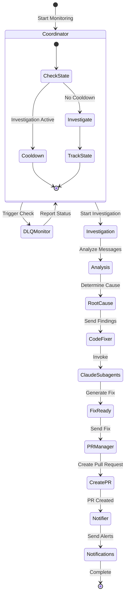
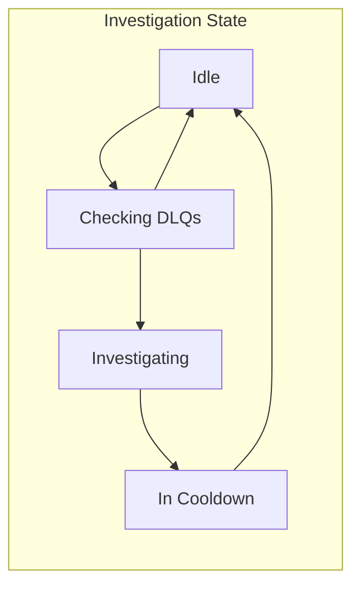
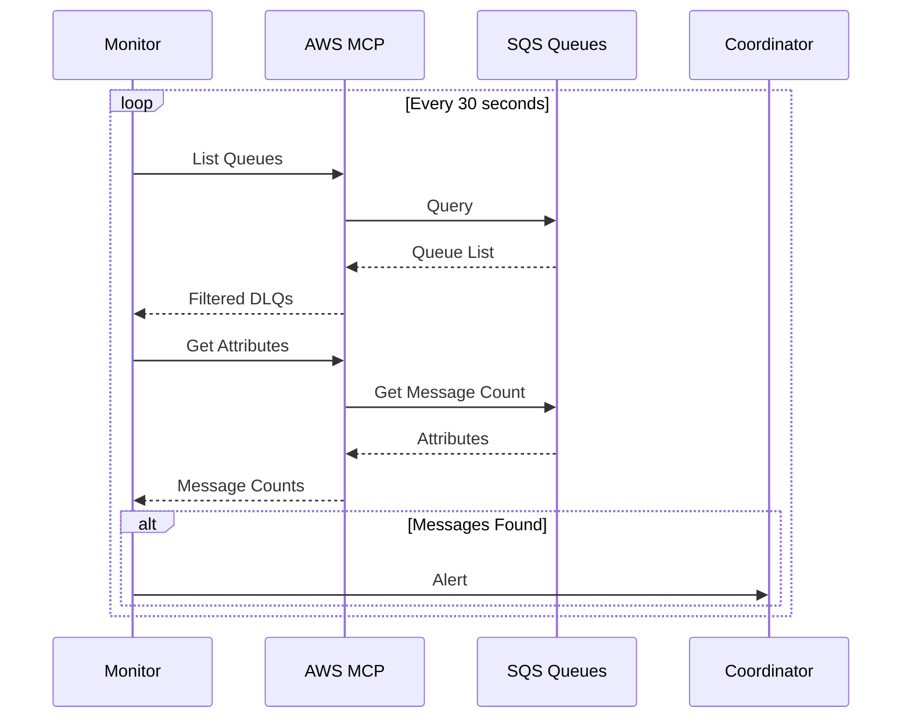
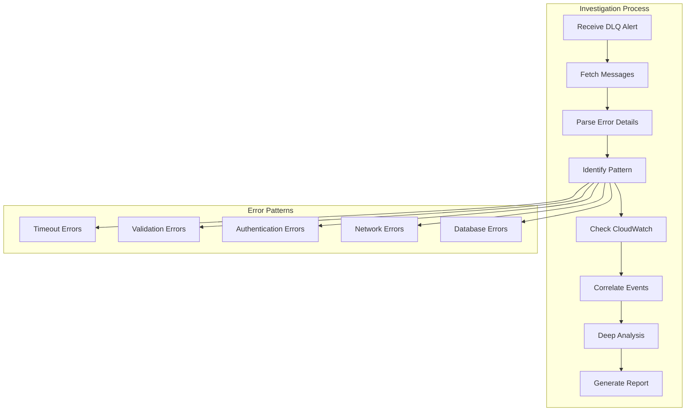
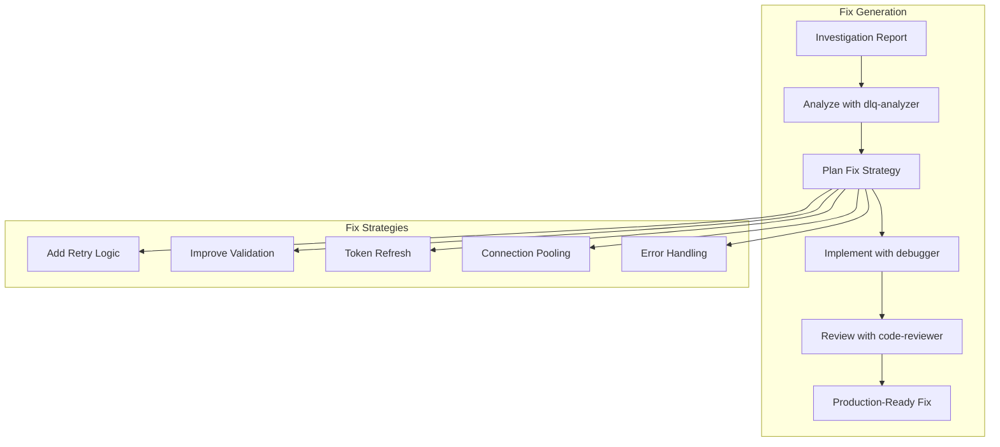
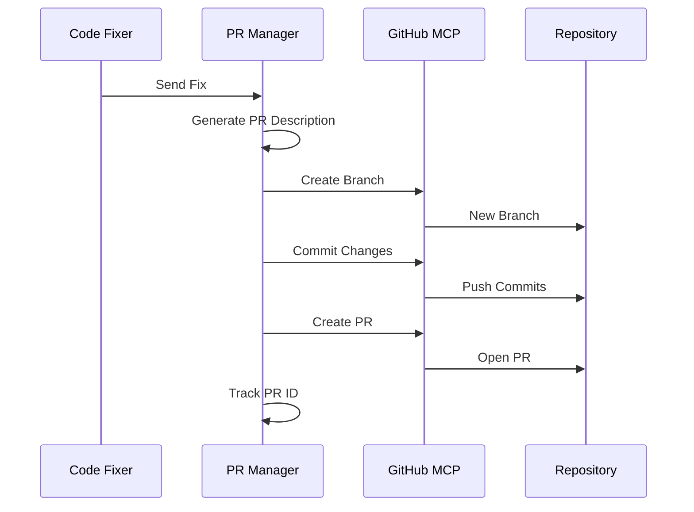
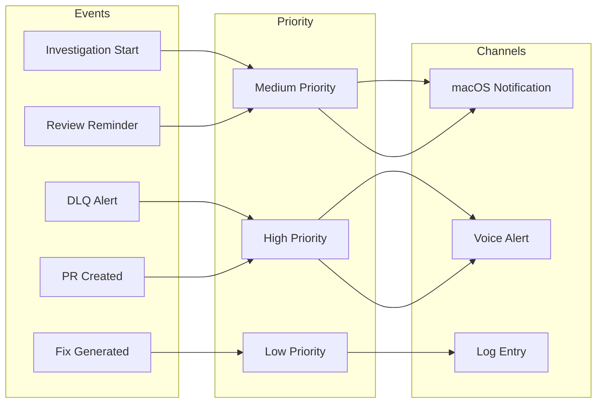
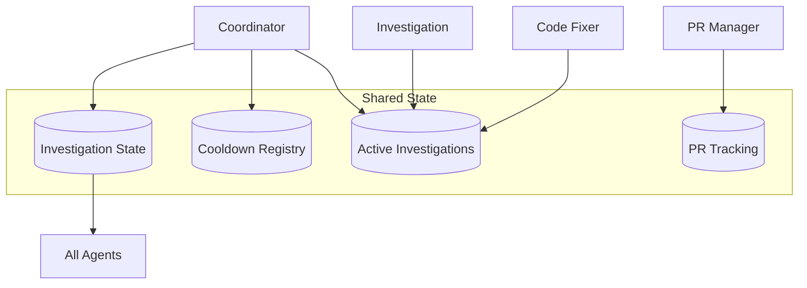

# ADK Agents Guide

## Agent Overview

The ADK Multi-Agent System consists of 6 specialized agents, each with specific responsibilities and capabilities. This guide provides detailed information about each agent's implementation, configuration, and interaction patterns.

## Agent Interaction Flow



## 1. Coordinator Agent

### Purpose
The Coordinator Agent is the brain of the system, orchestrating all other agents and managing the overall workflow.

### Implementation (`adk_agents/coordinator.py`)

```python
# Key responsibilities
- Orchestrate monitoring cycles
- Manage investigation state
- Prevent duplicate investigations
- Coordinate agent interactions
- Track cooldown periods
```

### Configuration

```yaml
# config/adk_config.yaml
agents:
  coordinator:
    check_interval: 30  # seconds
    cooldown_hours: 1
    max_concurrent_investigations: 3
    critical_dlqs:
      - fm-digitalguru-api-update-dlq-prod
      - fm-transaction-processor-dlq-prd
```

### State Management



### Key Methods

| Method | Description |
|--------|-------------|
| `should_auto_investigate()` | Determines if investigation should start |
| `mark_investigation_started()` | Records investigation start |
| `mark_investigation_completed()` | Updates state and starts cooldown |
| `track_active_investigations()` | Maintains investigation registry |

## 2. DLQ Monitor Agent

### Purpose
Monitors AWS SQS Dead Letter Queues for messages requiring investigation.

### Implementation (`adk_agents/dlq_monitor.py`)

```python
# MCP Integration
- Uses aws-api MCP server
- Uses sns-sqs MCP server
- Native AWS operations without boto3
```

### Monitoring Process



### Tools

```python
check_dlq_tool = Tool(
    name="check_dlq_messages",
    description="Check DLQ for messages",
    function=check_dlq_messages,
    parameters={
        "queue_url": str,
        "max_messages": int
    }
)

get_queue_attributes_tool = Tool(
    name="get_queue_attributes",
    description="Get queue statistics",
    function=get_queue_attributes,
    parameters={
        "queue_url": str
    }
)
```

## 3. Investigation Agent

### Purpose
Performs root cause analysis on DLQ messages using AI-powered investigation.

### Implementation (`adk_agents/investigator.py`)

```python
# MCP Integration
- Uses sequential-thinking MCP
- CloudWatch log correlation
- Pattern recognition
```

### Investigation Flow



### Error Pattern Recognition

| Pattern | Indicators | Investigation Focus |
|---------|------------|-------------------|
| Timeout | "timed out", "deadline exceeded" | Check timeouts, load, performance |
| Validation | "invalid", "required field" | Input validation, data format |
| Authentication | "401", "403", "unauthorized" | Token expiry, permissions |
| Network | "connection refused", "ECONNRESET" | Network issues, endpoints |
| Database | "deadlock", "connection pool" | DB performance, queries |

## 4. Code Fixer Agent

### Purpose
Implements robust fixes for identified issues using Claude subagents.

### Implementation (`adk_agents/code_fixer.py`)

```python
# Claude Subagent Integration
- Invokes dlq-analyzer for analysis
- Uses debugger for fix implementation
- Employs code-reviewer for quality
```

### Fix Generation Process



### Fix Templates

```python
# Timeout Fix Template
@retry(wait=wait_exponential(min=1, max=60), 
       stop=stop_after_attempt(3))
def process_with_retry(message):
    # Implementation

# Validation Fix Template
def validate_input(data):
    required_fields = ['id', 'type', 'payload']
    for field in required_fields:
        if field not in data:
            raise ValueError(f"Missing: {field}")

# Authentication Fix Template
def get_auth_token(force_refresh=False):
    if force_refresh or token_expired():
        return refresh_token()
    return cached_token()
```

## 5. PR Manager Agent

### Purpose
Creates and manages GitHub pull requests with comprehensive documentation.

### Implementation (`adk_agents/pr_manager.py`)

```python
# GitHub MCP Integration
- Uses github MCP server
- Native GitHub API operations
- PR template generation
```

### PR Creation Flow



### PR Template

```markdown
## 🔧 Automated Fix for DLQ Issue

### Investigation Summary
- **Queue**: {queue_name}
- **Error Type**: {error_type}
- **Root Cause**: {root_cause}
- **Occurrences**: {message_count}

### Changes Made
- {change_1}
- {change_2}

### Testing
- [ ] Unit tests pass
- [ ] Integration tests pass
- [ ] Manual testing completed

### Investigation Details
{detailed_analysis}

---
🤖 Generated by ADK Multi-Agent System
```

## 6. Notifier Agent

### Purpose
Handles all system notifications across multiple channels.

### Implementation (`adk_agents/notifier.py`)

```python
# Notification Channels
- macOS native notifications
- ElevenLabs TTS voice
- Console output
- Log files
```

### Notification Flow



### Notification Types

| Type | Channel | Priority | Example |
|------|---------|----------|---------|
| DLQ Alert | Voice + Visual | High | "Critical DLQ has 10 messages" |
| Investigation | Visual | Medium | "Starting investigation for payment-dlq" |
| Fix Ready | Log | Low | "Fix generated for timeout error" |
| PR Created | Voice + Visual | High | "Pull request #123 created" |
| Reminder | Visual | Medium | "PR #123 awaiting review (10 min)" |

## Agent Communication Protocol

### Message Format

```python
# Standard agent message
{
    "from_agent": "coordinator",
    "to_agent": "dlq_monitor",
    "action": "check_queues",
    "payload": {
        "queues": ["queue1", "queue2"],
        "threshold": 5
    },
    "timestamp": "2024-01-01T12:00:00Z",
    "correlation_id": "uuid-here"
}
```

### State Synchronization



## Testing Agents

### Unit Testing

```python
# Test individual agent
from adk_agents import coordinator

def test_coordinator_cooldown():
    agent = coordinator
    assert agent.should_auto_investigate("test-dlq", 5)
    agent.mark_investigation_started("test-dlq")
    assert not agent.should_auto_investigate("test-dlq", 5)
```

### Integration Testing

```bash
# Test full system
python tests/integration/test_adk_system.py

# Test specific workflow
python -m pytest tests/integration/test_investigation_flow.py
```

### Agent Validation

```bash
# Validate all agents
python tests/validation/test_adk_simple.py

# Check agent initialization
python -c "from adk_agents import *; print('All agents loaded')"
```

## Best Practices

### 1. Error Handling
- Always use try-except in agent methods
- Log errors with context
- Gracefully degrade functionality
- Notify on critical failures

### 2. State Management
- Use atomic operations for state updates
- Implement proper locking for shared resources
- Persist critical state to disk
- Regular state validation

### 3. Performance
- Implement timeouts for all operations
- Use async where possible
- Cache frequently accessed data
- Monitor resource usage

### 4. Security
- Never log sensitive data
- Validate all inputs
- Use environment variables for secrets
- Implement rate limiting

### 5. Monitoring
- Log all agent actions
- Track metrics and KPIs
- Implement health checks
- Set up alerting thresholds