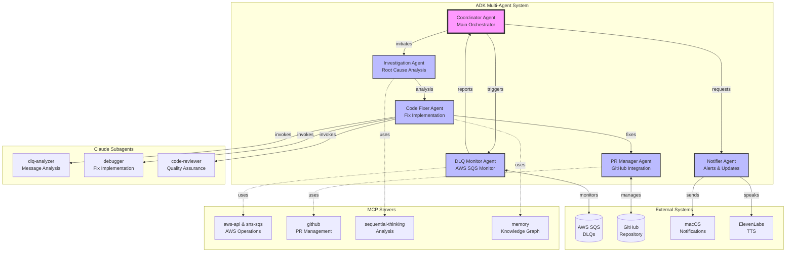
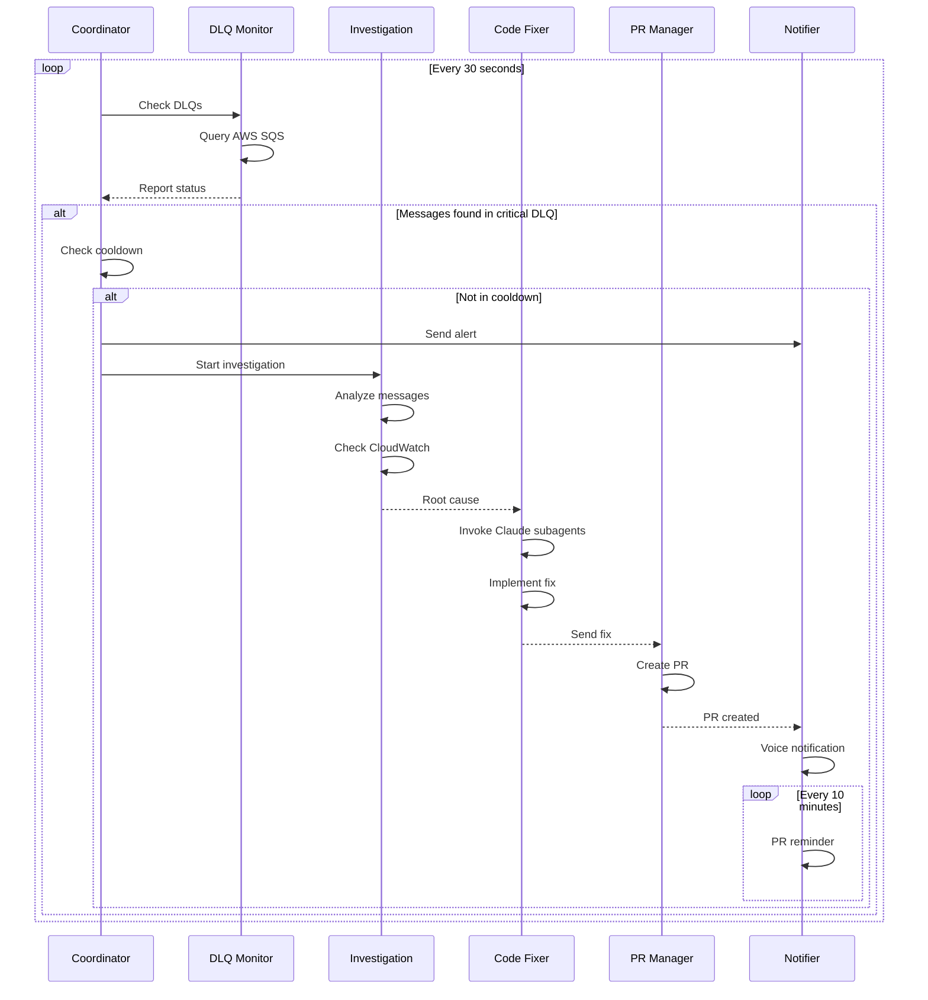
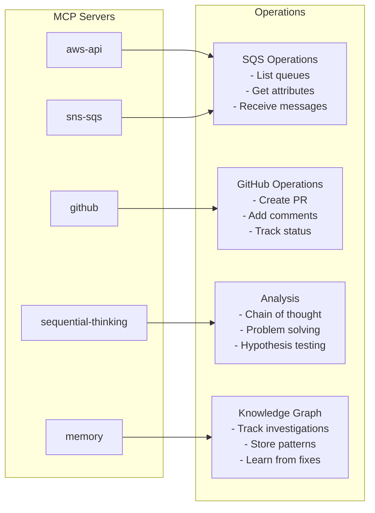
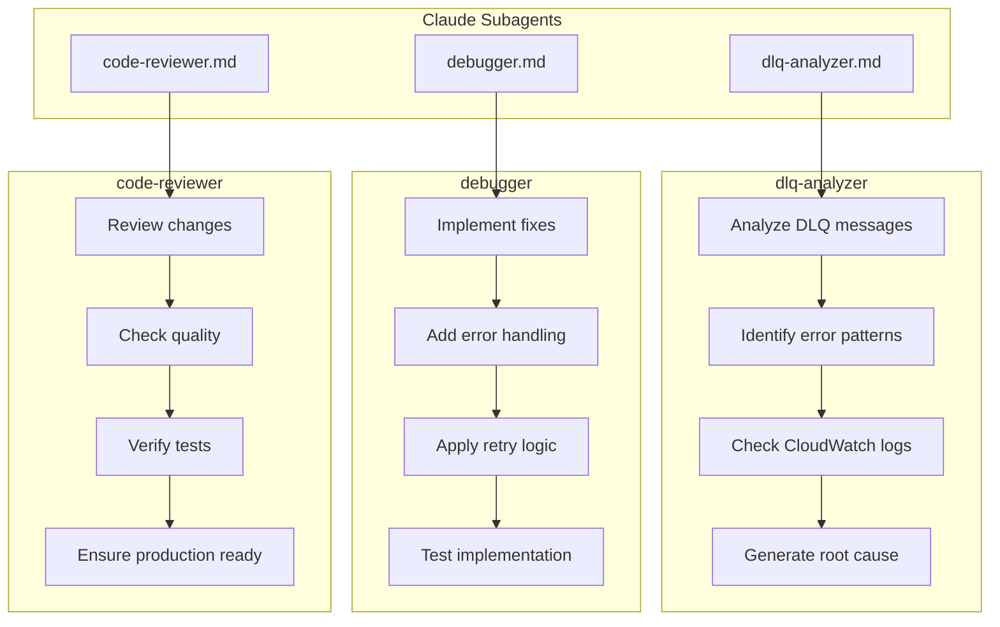

# ADK Multi-Agent DLQ Monitor Architecture

## Overview

The ADK Multi-Agent DLQ Monitor is a sophisticated autonomous system that monitors AWS Dead Letter Queues, investigates issues, implements fixes, and creates pull requests - all without human intervention.

## System Architecture



## Agent Workflow



## Component Details

### 1. Coordinator Agent (`coordinator.py`)
- **Role**: Main orchestrator
- **Responsibilities**:
  - Trigger monitoring cycles
  - Manage investigation state
  - Prevent duplicate investigations
  - Coordinate agent interactions
- **Key Features**:
  - 1-hour cooldown between investigations
  - State tracking for active investigations
  - Priority handling for critical DLQs

### 2. DLQ Monitor Agent (`dlq_monitor.py`)
- **Role**: AWS SQS monitoring
- **MCP Integration**: aws-api, sns-sqs
- **Operations**:
  - List queues matching DLQ patterns
  - Get queue attributes
  - Check message counts
  - Report alerts to coordinator

### 3. Investigation Agent (`investigator.py`)
- **Role**: Root cause analysis
- **MCP Integration**: sequential-thinking
- **Analysis Types**:
  - Timeout errors
  - Validation failures
  - Authentication issues
  - Network problems
  - Database errors
- **Output**: Detailed investigation report

### 4. Code Fixer Agent (`code_fixer.py`)
- **Role**: Fix implementation
- **Claude Subagents**:
  - `dlq-analyzer`: Message analysis
  - `debugger`: Fix implementation
  - `code-reviewer`: Quality assurance
- **Fix Patterns**:
  - Retry logic with exponential backoff
  - Input validation improvements
  - Token refresh mechanisms
  - Connection pooling
  - Error handling enhancements

### 5. PR Manager Agent (`pr_manager.py`)
- **Role**: GitHub integration
- **MCP Integration**: github
- **Features**:
  - Create comprehensive PRs
  - Include investigation details
  - Add fix explanations
  - Track PR status

### 6. Notifier Agent (`notifier.py`)
- **Role**: Multi-channel notifications
- **Channels**:
  - macOS native notifications
  - ElevenLabs voice announcements
  - PR reminders
- **Alert Types**:
  - DLQ message detection
  - Investigation start/complete
  - PR creation
  - Review reminders

## MCP Server Integration



## Claude Subagent Architecture



## Configuration

### Environment Variables
```bash
GEMINI_API_KEY=your_gemini_key       # Google AI API key
GITHUB_TOKEN=your_github_token       # GitHub access token
AWS_PROFILE=FABIO-PROD               # AWS profile
AWS_REGION=sa-east-1                 # AWS region
```

### ADK Configuration (`config/adk_config.yaml`)
```yaml
model:
  provider: gemini
  default_model: gemini-2.0-flash
  temperature: 0.7

agents:
  coordinator:
    check_interval: 30
    cooldown_hours: 1
  
monitoring:
  critical_dlqs:
    - fm-digitalguru-api-update-dlq-prod
    - fm-transaction-processor-dlq-prd
```

### MCP Settings (`config/mcp_settings.json`)
```json
{
  "mcpServers": {
    "aws-api": {
      "command": "npx",
      "args": ["-y", "@mcp-servers/aws"],
      "env": {
        "AWS_PROFILE": "FABIO-PROD",
        "AWS_REGION": "sa-east-1"
      }
    },
    "github": {
      "command": "npx",
      "args": ["-y", "@modelcontextprotocol/server-github"],
      "env": {
        "GITHUB_TOKEN": "${GITHUB_TOKEN}"
      }
    }
  }
}
```

## Deployment

### Prerequisites
1. Python 3.11+
2. Google ADK installed
3. AWS credentials configured
4. GitHub token with repo access
5. Gemini API key

### Installation
```bash
# Clone repository
git clone <repository>
cd lpd-claude-code-monitor

# Setup environment
python3 -m venv venv
source venv/bin/activate
pip install -r requirements_adk.txt

# Configure
cp .env.template .env
# Edit .env with your credentials

# Validate setup
python tests/validation/test_adk_simple.py
```

### Running
```bash
# Production monitoring
./scripts/start_monitor.sh adk-production

# Test mode (3 cycles)
./scripts/start_monitor.sh adk-test 3
```

## Monitoring & Observability

### Logs
- Location: `logs/adk_monitor.log`
- Includes agent interactions
- Investigation details
- Error tracking

### State Files
- `.claude_sessions.json`: Active Claude sessions
- Investigation tracking
- PR status monitoring

### Metrics
- DLQ message counts
- Investigation frequency
- Fix success rate
- PR creation/merge rate

## Security Considerations

1. **Credentials**: All sensitive data in environment variables
2. **AWS Access**: Limited to specific profile and region
3. **GitHub Scope**: Repository access only
4. **Code Review**: All fixes go through PR process
5. **Cooldown**: Prevents investigation loops

## Performance

- **Monitoring Interval**: 30 seconds
- **Investigation Cooldown**: 1 hour
- **PR Reminders**: Every 10 minutes
- **Agent Response**: < 5 seconds typical
- **Fix Generation**: 30-60 seconds
- **PR Creation**: < 10 seconds

## Future Enhancements

1. **Machine Learning**: Pattern recognition for common issues
2. **Auto-merge**: Automatic PR merging after tests pass
3. **Multi-region**: Support for multiple AWS regions
4. **Slack Integration**: Team notifications
5. **Metrics Dashboard**: Real-time monitoring UI
6. **A/B Testing**: Compare fix effectiveness