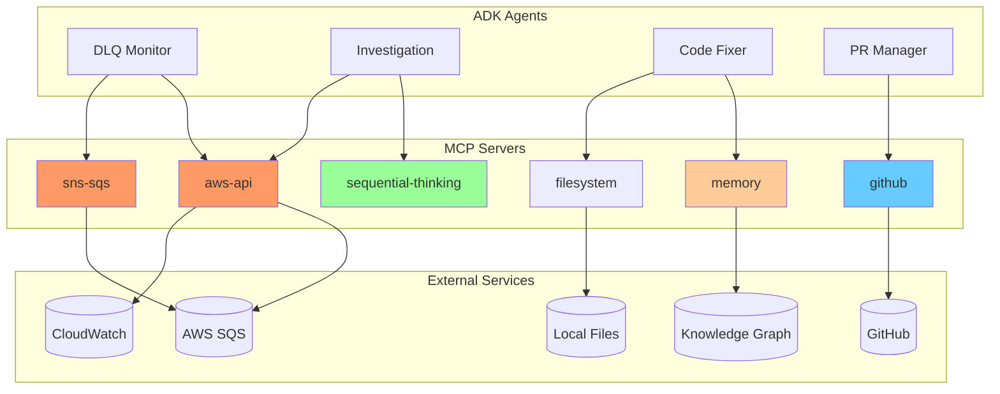
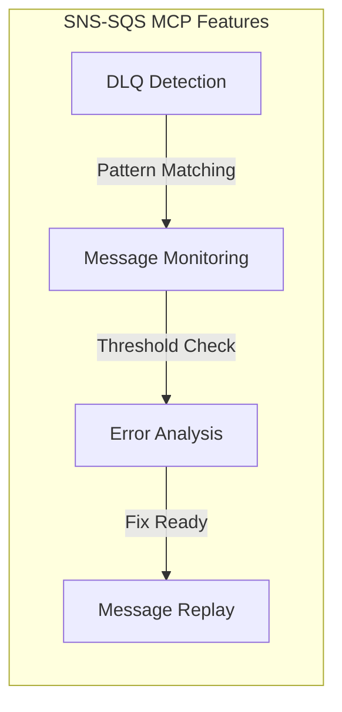
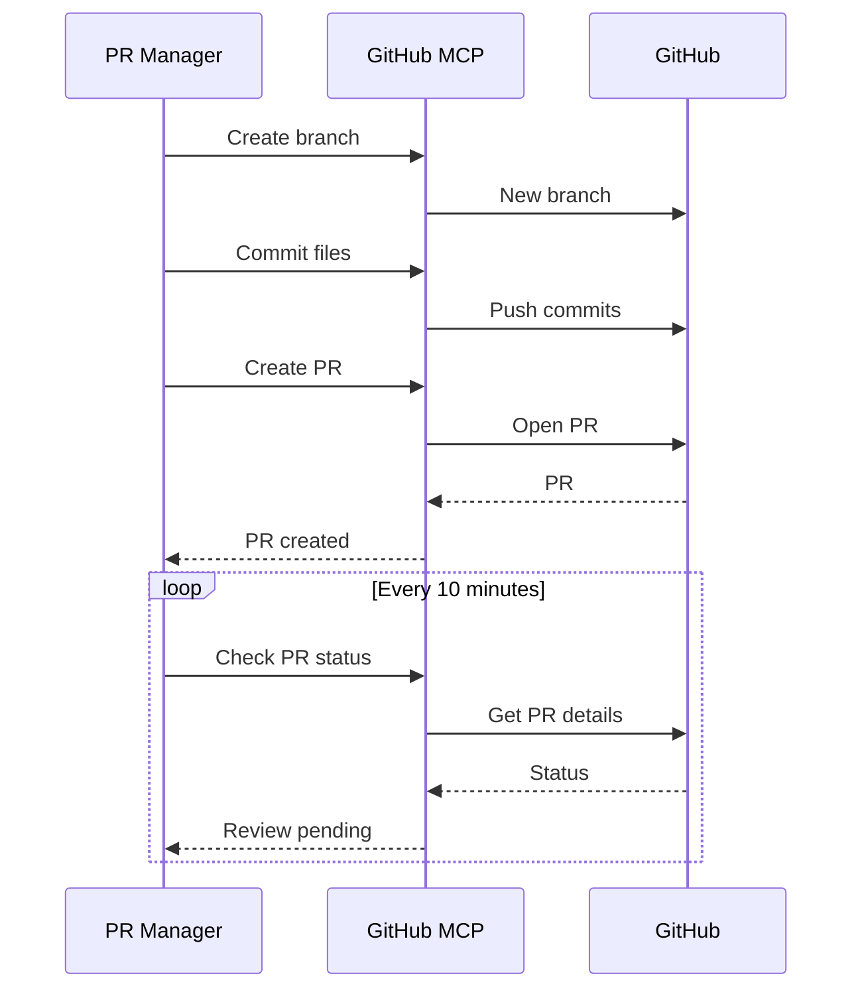
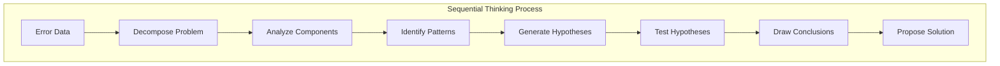
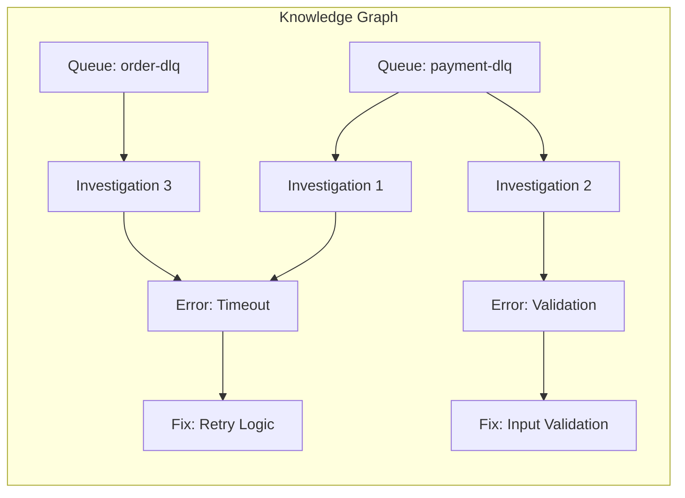
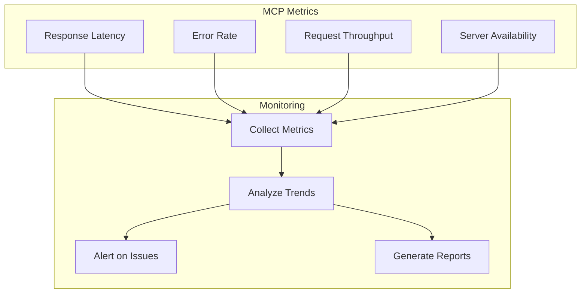

# MCP Server Integration Guide

## Overview

The Model Context Protocol (MCP) servers provide native integration with external services, eliminating the need for custom API implementations. This guide details the configuration, usage, and best practices for each MCP server used in the ADK Multi-Agent System.

## MCP Architecture



## MCP Server Configuration

### Configuration File (`config/mcp_settings.json`)

```json
{
  "mcpServers": {
    "aws-api": {
      "command": "npx",
      "args": ["-y", "@mcp-servers/aws"],
      "env": {
        "AWS_PROFILE": "FABIO-PROD",
        "AWS_REGION": "sa-east-1",
        "AWS_ACCESS_KEY_ID": "${AWS_ACCESS_KEY_ID}",
        "AWS_SECRET_ACCESS_KEY": "${AWS_SECRET_ACCESS_KEY}"
      }
    },
    "sns-sqs": {
      "command": "node",
      "args": ["/Users/fabio.santos/mcp/aws/mcp/packages/sqs-mcp-server/dist/index.js"],
      "env": {
        "AWS_PROFILE": "FABIO-PROD",
        "AWS_REGION": "sa-east-1"
      }
    },
    "github": {
      "command": "npx",
      "args": ["-y", "@modelcontextprotocol/server-github"],
      "env": {
        "GITHUB_TOKEN": "${GITHUB_TOKEN}"
      }
    },
    "sequential-thinking": {
      "command": "npx",
      "args": ["-y", "@modelcontextprotocol/server-sequential-thinking"]
    },
    "memory": {
      "command": "npx",
      "args": ["-y", "@modelcontextprotocol/server-memory"]
    },
    "filesystem": {
      "command": "npx",
      "args": ["-y", "@modelcontextprotocol/server-filesystem"],
      "env": {
        "WORKSPACE_DIR": "/Users/fabio.santos/LPD Repos/lpd-claude-code-monitor"
      }
    }
  }
}
```

## 1. AWS API MCP Server

### Purpose
Provides native AWS service integration for comprehensive AWS operations.

### Capabilities
- **Services**: EC2, S3, Lambda, DynamoDB, CloudWatch, IAM, etc.
- **Operations**: Full CRUD operations on AWS resources
- **Authentication**: Uses AWS CLI profiles or environment variables

### Usage in Agents

```python
# DLQ Monitor Agent usage
async def list_sqs_queues():
    result = await mcp_client.call_tool(
        server="aws-api",
        tool="aws_sqs_list_queues",
        arguments={}
    )
    return result["QueueUrls"]

async def get_cloudwatch_logs(log_group, start_time):
    result = await mcp_client.call_tool(
        server="aws-api",
        tool="aws_logs_filter_log_events",
        arguments={
            "logGroupName": log_group,
            "startTime": start_time
        }
    )
    return result["events"]
```

### Available Tools

| Tool | Description | Usage |
|------|-------------|-------|
| `aws_sqs_list_queues` | List all SQS queues | DLQ discovery |
| `aws_sqs_get_queue_attributes` | Get queue statistics | Message counting |
| `aws_logs_filter_log_events` | Search CloudWatch logs | Error investigation |
| `aws_lambda_invoke` | Invoke Lambda functions | Trigger processing |

## 2. SNS-SQS MCP Server

### Purpose
Specialized server for Amazon SNS and SQS operations with enhanced DLQ support.

### Capabilities
- **SQS Operations**: Queue management, message handling, DLQ monitoring
- **SNS Operations**: Topic management, subscription handling
- **DLQ Features**: Automatic DLQ detection, message replay

### Usage in Agents

```python
# DLQ Monitor Agent usage
async def check_dlq_messages(queue_url):
    result = await mcp_client.call_tool(
        server="sns-sqs",
        tool="sqs_receive_messages",
        arguments={
            "QueueUrl": queue_url,
            "MaxNumberOfMessages": 10,
            "AttributeNames": ["All"],
            "MessageAttributeNames": ["All"]
        }
    )
    return result["Messages"]

async def get_dlq_count(queue_url):
    result = await mcp_client.call_tool(
        server="sns-sqs",
        tool="sqs_get_queue_attributes",
        arguments={
            "QueueUrl": queue_url,
            "AttributeNames": ["ApproximateNumberOfMessages"]
        }
    )
    return int(result["Attributes"]["ApproximateNumberOfMessages"])
```

### DLQ-Specific Features



## 3. GitHub MCP Server

### Purpose
Complete GitHub integration for repository management and PR operations.

### Capabilities
- **Repository Operations**: Clone, fork, create
- **PR Management**: Create, update, merge pull requests
- **Issue Tracking**: Create and manage issues
- **Code Operations**: Commit, push, branch management

### Usage in Agents

```python
# PR Manager Agent usage
async def create_pull_request(title, body, branch):
    result = await mcp_client.call_tool(
        server="github",
        tool="github_create_pull_request",
        arguments={
            "owner": "your-org",
            "repo": "lpd-claude-code-monitor",
            "title": title,
            "body": body,
            "head": branch,
            "base": "main"
        }
    )
    return result["number"]

async def add_pr_comment(pr_number, comment):
    await mcp_client.call_tool(
        server="github",
        tool="github_add_pr_comment",
        arguments={
            "owner": "your-org",
            "repo": "lpd-claude-code-monitor",
            "pr_number": pr_number,
            "body": comment
        }
    )
```

### PR Workflow



## 4. Sequential Thinking MCP Server

### Purpose
Provides structured problem-solving and analysis capabilities using chain-of-thought reasoning.

### Capabilities
- **Systematic Analysis**: Step-by-step problem decomposition
- **Hypothesis Testing**: Generate and validate hypotheses
- **Root Cause Analysis**: Identify underlying issues
- **Solution Generation**: Create actionable solutions

### Usage in Agents

```python
# Investigation Agent usage
async def analyze_error_pattern(error_messages):
    result = await mcp_client.call_tool(
        server="sequential-thinking",
        tool="analyze_problem",
        arguments={
            "problem": f"Analyze these DLQ errors: {error_messages}",
            "steps": [
                "Identify common patterns",
                "Determine root cause",
                "Suggest fix approach",
                "Evaluate risks"
            ]
        }
    )
    return result["analysis"]

async def generate_hypothesis(symptoms):
    result = await mcp_client.call_tool(
        server="sequential-thinking",
        tool="generate_hypothesis",
        arguments={
            "observations": symptoms,
            "domain": "AWS SQS processing errors"
        }
    )
    return result["hypotheses"]
```

### Thinking Process



## 5. Memory MCP Server

### Purpose
Maintains a knowledge graph for tracking investigations, patterns, and solutions.

### Capabilities
- **Entity Management**: Create and manage entities
- **Relationship Tracking**: Define relationships between entities
- **Pattern Recognition**: Identify recurring issues
- **Solution Database**: Store successful fixes

### Usage in Agents

```python
# Code Fixer Agent usage
async def store_investigation(queue_name, error_type, fix):
    # Create entity for investigation
    await mcp_client.call_tool(
        server="memory",
        tool="create_entity",
        arguments={
            "name": f"Investigation_{queue_name}_{timestamp}",
            "type": "Investigation",
            "properties": {
                "queue": queue_name,
                "error_type": error_type,
                "fix_applied": fix,
                "timestamp": timestamp
            }
        }
    )
    
    # Create relationship
    await mcp_client.call_tool(
        server="memory",
        tool="create_relationship",
        arguments={
            "from": queue_name,
            "to": f"Investigation_{queue_name}_{timestamp}",
            "type": "has_investigation"
        }
    )

async def find_similar_fixes(error_type):
    result = await mcp_client.call_tool(
        server="memory",
        tool="query_graph",
        arguments={
            "query": f"MATCH (i:Investigation) WHERE i.error_type = '{error_type}' RETURN i.fix_applied"
        }
    )
    return result["fixes"]
```

### Knowledge Graph Structure



## 6. Filesystem MCP Server

### Purpose
Provides file system operations for code modifications and file management.

### Capabilities
- **File Operations**: Read, write, delete files
- **Directory Management**: Create, list, remove directories
- **Code Modification**: Edit source files
- **Configuration Updates**: Modify config files

### Usage in Agents

```python
# Code Fixer Agent usage
async def apply_fix_to_file(file_path, original_code, fixed_code):
    # Read current file
    current = await mcp_client.call_tool(
        server="filesystem",
        tool="read_file",
        arguments={"path": file_path}
    )
    
    # Apply fix
    updated = current.replace(original_code, fixed_code)
    
    # Write updated file
    await mcp_client.call_tool(
        server="filesystem",
        tool="write_file",
        arguments={
            "path": file_path,
            "content": updated
        }
    )

async def backup_file(file_path):
    await mcp_client.call_tool(
        server="filesystem",
        tool="copy_file",
        arguments={
            "source": file_path,
            "destination": f"{file_path}.backup"
        }
    )
```

## MCP Server Best Practices

### 1. Error Handling

```python
async def safe_mcp_call(server, tool, arguments):
    try:
        result = await mcp_client.call_tool(server, tool, arguments)
        return result
    except MCPServerError as e:
        logger.error(f"MCP server error: {e}")
        # Fallback logic
        return None
    except TimeoutError:
        logger.warning(f"MCP call timed out: {server}.{tool}")
        # Retry with backoff
        return await retry_with_backoff(server, tool, arguments)
```

### 2. Connection Management

```python
class MCPConnectionPool:
    def __init__(self):
        self.connections = {}
        self.max_retries = 3
    
    async def get_connection(self, server):
        if server not in self.connections:
            self.connections[server] = await self.create_connection(server)
        return self.connections[server]
    
    async def health_check(self):
        for server, conn in self.connections.items():
            if not await conn.ping():
                await self.reconnect(server)
```

### 3. Performance Optimization

```python
# Batch operations
async def batch_sqs_operations(operations):
    tasks = []
    for op in operations:
        task = mcp_client.call_tool(
            server="sns-sqs",
            tool=op["tool"],
            arguments=op["arguments"]
        )
        tasks.append(task)
    
    results = await asyncio.gather(*tasks)
    return results

# Caching
@cache(ttl=300)  # 5 minute cache
async def get_queue_attributes_cached(queue_url):
    return await mcp_client.call_tool(
        server="sns-sqs",
        tool="sqs_get_queue_attributes",
        arguments={"QueueUrl": queue_url}
    )
```

### 4. Security Considerations

```python
# Environment variable validation
def validate_mcp_config():
    required_env = {
        "aws-api": ["AWS_PROFILE", "AWS_REGION"],
        "github": ["GITHUB_TOKEN"],
        "filesystem": ["WORKSPACE_DIR"]
    }
    
    for server, vars in required_env.items():
        for var in vars:
            if not os.getenv(var):
                raise ConfigError(f"Missing {var} for {server}")

# Sanitize inputs
def sanitize_mcp_arguments(arguments):
    # Remove sensitive data from logs
    safe_args = arguments.copy()
    if "token" in safe_args:
        safe_args["token"] = "***"
    return safe_args
```

## Monitoring MCP Servers

### Health Checks

```python
async def check_mcp_health():
    health_status = {}
    
    for server in ["aws-api", "sns-sqs", "github", "sequential-thinking", "memory"]:
        try:
            result = await mcp_client.call_tool(
                server=server,
                tool="health_check",
                arguments={}
            )
            health_status[server] = "healthy"
        except Exception as e:
            health_status[server] = f"unhealthy: {e}"
    
    return health_status
```

### Metrics Collection



## Troubleshooting MCP Servers

### Common Issues

| Issue | Cause | Solution |
|-------|-------|----------|
| "MCP server not found" | Server not installed | Run `npm install -g @server-name` |
| "Authentication failed" | Missing credentials | Check environment variables |
| "Connection timeout" | Network issues | Check firewall/proxy settings |
| "Rate limit exceeded" | Too many requests | Implement rate limiting |
| "Invalid arguments" | Schema mismatch | Validate against server schema |

### Debug Commands

```bash
# Test MCP server directly
npx @mcp-servers/aws --test

# Check server logs
tail -f ~/.mcp/logs/aws-api.log

# Validate configuration
python -c "import json; json.load(open('config/mcp_settings.json'))"

# Test connection
curl -X POST http://localhost:3000/health
```